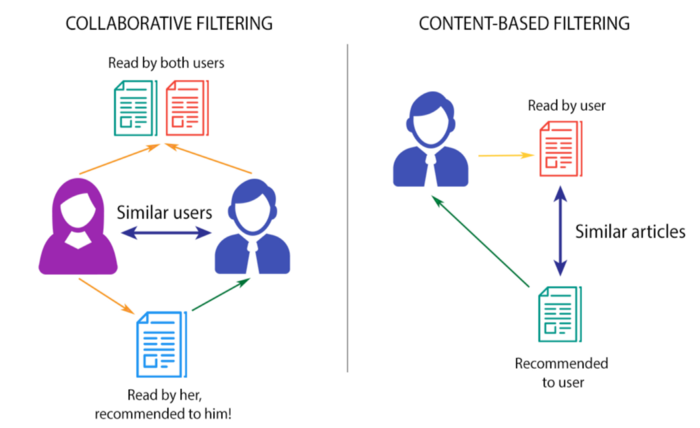
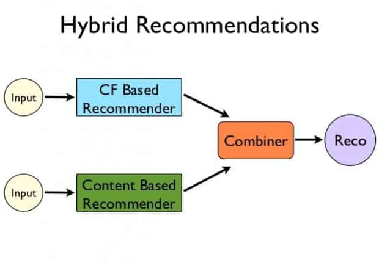
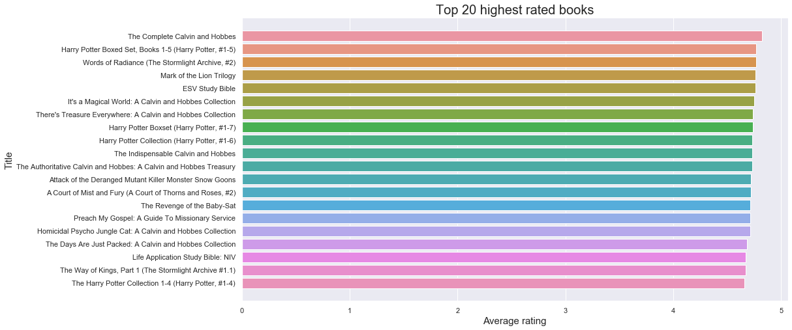
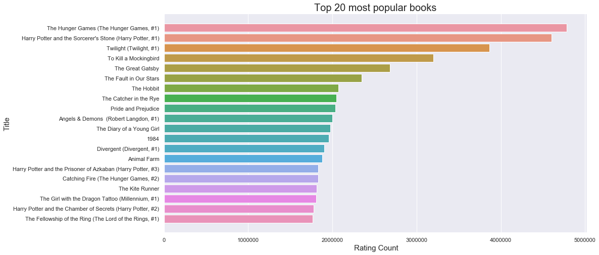
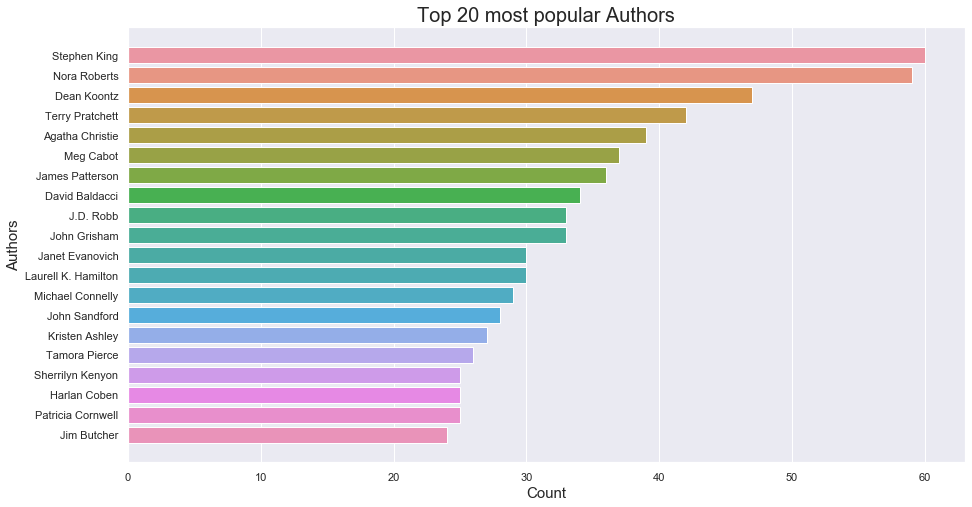
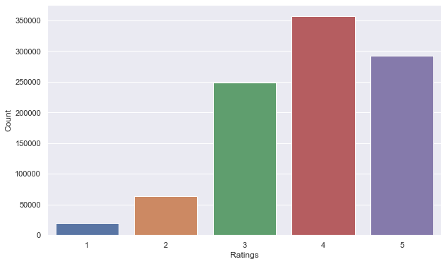
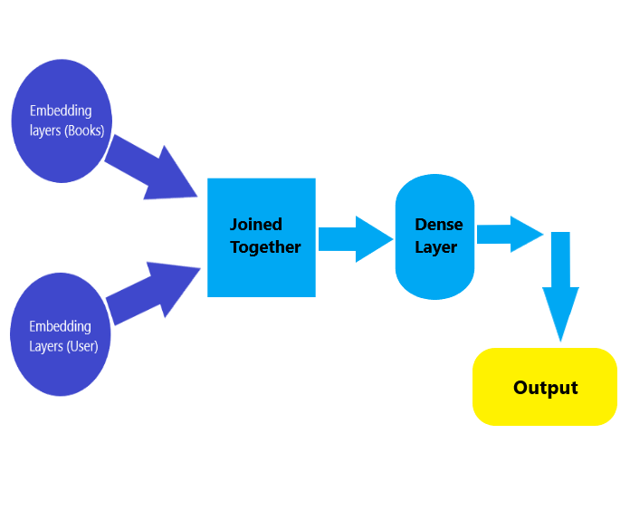
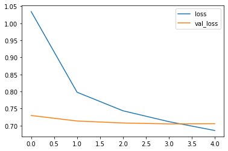

# [Books Recommendation System](https://pritamaich.github.io/Books-Recommendation-System/)

#### What is a Recomendation System?
  Recommender systems or Recommendation systems aim to predict users’ interests and recommend product items that quite likely are interesting for them. They are among the most powerful machine learning systems that online retailers implement in order to drive sales.
  
  There are two primary types of recommender systems:
    
1. Collaborative Filtering Systems: These types of recommender systems are based on the user’s direct behavior. That is, this system builds a model of the user based on past choices, activities, and preferences. It then uses this knowledge to predict what the user will like based on their similarity to other user profiles.
    
2. Content-Based Filtering System: Content-based recommender systems, on the other hand, are based on the items, and not necessarily the users. This method builds an understanding of similarity between items. That is, it recommends items that are similar to each other in terms of properties.

    
   There is a third type of recommender system, known as a hybrid approach. As you can guess, this approach combines the collaborative and content-based approaches to build better and more generalized systems. That is, it basically combines the strength of both approaches.

### About the dataset
  There have been good datasets for movies (Netflix, Movielens) and music (Million Songs) recommendation, but not for books. That is, until now.

This dataset contains ratings for ten thousand popular books. As to the source, let's say that these ratings were found on the internet. Generally, there are 100 reviews for each book, although some have less - fewer - ratings. Ratings go from one to five.

Both book IDs and user IDs are contiguous. For books, they are 1-10000, for users, 1-53424. All users have made at least two ratings. Median number of ratings per user is 8.

There are also books marked to read by the users, book metadata (author, year, etc.) and tags.

This dataset is taken from kaggle. [Click here](https://www.kaggle.com/zygmunt/goodbooks-10k)

## Project overview:

#### Resources:
  Programming language: Python 3.7,
  
  Packages used: pandas, numpy, matplotlib, seaborn, sklearn, tensorflow.

#### Project goal:
  To build a recommendation system that will recommend a user top 5 books of his/her interest.
  
#### Project architecture:

**Exploratory data analysis (EDA):**
  - Visualization on some important parts like most rated books, most popular books, most popular authors, most number of ratings

**Data Preprocessing:**
  - Data cleansing
  - Nan value treatment
  - Extraction of relevant featuress
  
**Model building:**
  - Splitting data into train and test set
  - Neural Network creation(Using functional API)
  - Training on train data and validating on test data

**Recommendation:**
  - Loading model
  - Creating a function for recommendation

### Data Collection:

Download the dataset from [here](https://www.kaggle.com/zygmunt/goodbooks-10k)
  
### 1. EDA:  

a) Loading the csv files

b) Checking the description of the daatsets like the data types, how many rows , columns, etc

c) Explored the following factors:

  - Top 20 highest rated books
  

  
  - Top 20 most popular books
  

  
  - Most popular authors
  

  
  - Most number of ratings
  

  
### 2. Data Preprocessing:

a) Extracted the most relevant columns that are needed to recommend a book to a user.

The final columns are: 'id', 'book_id', 'isbn', 'authors', 'original_publication_year', 'title', 'average_rating', 'ratings_count', 'small_image_url'
           
b) Checked null values and filled those null values because removing those null values would cause some book records to get deleted as well.
    
    books_new = books_new.fillna('NA')

c) Saved the final dataset for recommendation.

### 3. Model building:
We used the ratings dataset to train our model.

a) Splitting the dataset into train and test set (80-20 split ratio)

b) The Neural Network architecture we’re going to create will have two input embedding layers. The first embedding layer accepts the books, and the second the users. These two embeddings are trained separately and then combined together before being passed to a dense layer.

c) Stored the number of unique books and unique users in two seperate variables.

d) Built the embedding layers for both books and users

    #Embedding layer for books
    books_input = Input(shape=[1])#1st Input Layer
    embedding_layer_books = Embedding(book_id + 1,10)(books_input)#Embedding layer
    embedding_output_books = Flatten()(embedding_layer_books)#Embedding layer output

    #Embedding layer for users
    users_input = Input(shape=[1])#1st Input Layer
    embedding_layer_users = Embedding(user_id + 1,10)(users_input)#Embedding layer
    embedding_output_users = Flatten()(embedding_layer_users)#Embedding layer output
 
e)Joined the two layers using tf.keras.Concatenate() and added a Dense layer on top of that with 128 neurons and a dropout layer with a dropout rate of 0.5, used Rectified linear unit as activation function. Then used the tensorflow Model class to create a single model from our defined architecture. This model is expecting two input arrays (books and users).
        
    #Concatination and Dense layer

    joining_layer = Concatenate()([embedding_output_books, embedding_output_users])
    hidden_layer_1 = Dense(128, activation='relu')(joining_layer)
    hidden_layer_1 = Dropout(0.5)(hidden_layer_1)

    output_layer = hidden_layer_2 = Dense(1)(hidden_layer_1)

    model = tf.keras.Model([books_input, users_input], output_layer)

f) Then compiled the model with Adam optimizer and customized the learning rate(0.001) and decay rate(1e-06). The loss function used here is Mean Squared error.
  Mean Squared error (MSE) is the average of the squared error that is used as the loss function for least squares regression: It is the sum, over all the data points, of the square of the difference between the predicted and actual target variables, divided by the number of data points.
  
g) Finally trained the model on train set and validated on the test set. Then saved the model for use in the recommendation part.
    
    Epoch 1/15
    12272/12272 [==============================] - 94s 8ms/step - loss: 1.0344 - val_loss: 0.7296
    Epoch 2/15
    12272/12272 [==============================] - 95s 8ms/step - loss: 0.7978 - val_loss: 0.7134
    Epoch 3/15
    12272/12272 [==============================] - 95s 8ms/step - loss: 0.7434 - val_loss: 0.7076
    Epoch 4/15
    12272/12272 [==============================] - 95s 8ms/step - loss: 0.7115 - val_loss: 0.7049
    Epoch 5/15
    12272/12272 [==============================] - 100s 8ms/step - loss: 0.6856 - val_loss: 0.7055
  
  The loss curve:
  

  
### 4. Recommendation:

a) Loaded the model and the books and ratings dataset. The recommendations are gonna be made from the books dataset.

b) Defined a function that is expecting a parameter input 'user_id' which is basically a unique id for each user. The function will return a dataset containg the top 5 recommended books for that particlular user.
    
    #Defining a function that will recommend top 5 books
    def recommend(user_id):
    books = pd.read_csv('books_cleaned.csv')
    ratings = pd.read_csv('ratings.csv')

    book_id = list(ratings.book_id.unique()) #grabbing all the unique books

    book_arr = np.array(book_id) #geting all book IDs and storing them in the form of an array
    user_arr = np.array([user_id for i in range(len(book_id))])
    prediction = model.predict([book_arr, user_arr])

    prediction = prediction.reshape(-1) #reshape to single dimension
    prediction_ids = np.argsort(-prediction)[0:5]

    recommended_books = pd.DataFrame(books.iloc[prediction_ids], columns = ['book_id', 'isbn', 'authors', 'title', 'average_rating' ])
    print('Top 5 recommended books for you: \n')
    return recommended_books

### Conclusion:
  Recommender systems are a powerful new technology for extracting additional value for a business from its user databases. Recommender systems benefit users by enabling them to find items they like. Conversely, they help the business by generating more sales.
